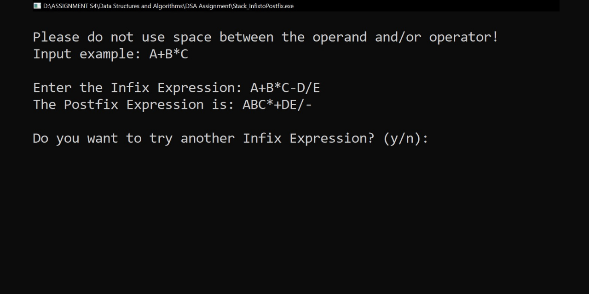

# Infix to Postfix Converter Program using C++ Programming Language
This is a project of the Data Structures and Algorithms course. In this project, I created an Infix to Postfix Converter Program using a stack and I used C++ as the programming language with the infix expression that the users must input and the postfix expression as the result or output.

